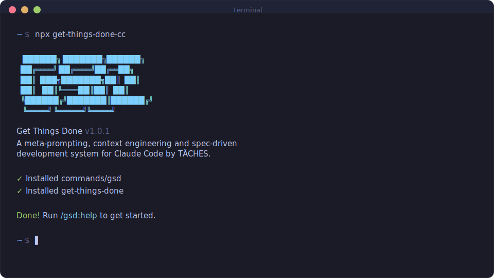

<div align="center">

# Get Things Done

[English](README.md) · **Português** · [简体中文](README.zh-CN.md) · [日本語](README.ja-JP.md)

**Um sistema leve e poderoso de meta-prompting, engenharia de contexto e desenvolvimento orientado a especificação para Claude Code, OpenCode, Gemini CLI, Codex, Copilot, Cursor e Antigravity.**

**Resolve context rot — a degradação de qualidade que acontece conforme o Claude enche a janela de contexto.**

[](https://www.npmjs.com/package/get-things-done-cc)
[](https://www.npmjs.com/package/get-things-done-cc)
[](https://github.com/gtd-build/get-things-done/actions/workflows/test.yml)
[](https://discord.gg/gsd)
[](https://x.com/gsd_foundation)
[](https://dexscreener.com/solana/dwudwjvan7bzkw9zwlbyv6kspdlvhwzrqy6ebk8xzxkv)
[](https://github.com/gtd-build/get-things-done)
[](LICENSE)

<br>

```bash
npx get-things-done-cc@latest
```

**Funciona em Mac, Windows e Linux.**

<br>



<br>

*"Se você sabe claramente o que quer, isso VAI construir para você. Sem enrolação."*

*"Eu já usei SpecKit, OpenSpec e Taskmaster — este me deu os melhores resultados."*

*"De longe a adição mais poderosa ao meu Claude Code. Nada superengenheirado. Simplesmente faz o trabalho."*

<br>

**Confiado por engenheiros da Amazon, Google, Shopify e Webflow.**

[Por que eu criei isso](#por-que-eu-criei-isso) · [Como funciona](#como-funciona) · [Comandos](#comandos) · [Por que funciona](#por-que-funciona) · [Guia do usuário](docs/pt-BR/USER-GUIDE.md)

</div>

---

## Por que eu criei isso

Sou desenvolvedor solo. Eu não escrevo código — o Claude Code escreve.

Existem outras ferramentas de desenvolvimento orientado por especificação. BMAD, Speckit... Mas quase todas parecem mais complexas do que o necessário (cerimônias de sprint, story points, sync com stakeholders, retrospectivas, fluxos Jira) ou não entendem de verdade o panorama do que você está construindo. Eu não sou uma empresa de software com 50 pessoas. Não quero teatro corporativo. Só quero construir coisas boas que funcionem.

Então eu criei o GTD. A complexidade fica no sistema, não no seu fluxo. Por trás: engenharia de contexto, formatação XML de prompts, orquestração de subagentes, gerenciamento de estado. O que você vê: alguns comandos que simplesmente funcionam.

O sistema dá ao Claude tudo que ele precisa para fazer o trabalho *e* validar o resultado. Eu confio no fluxo. Ele entrega.

— **TÂCHES**

---

Vibe coding ganhou má fama. Você descreve algo, a IA gera código, e sai um resultado inconsistente que quebra em escala.

O GTD corrige isso. É a camada de engenharia de contexto que torna o Claude Code confiável.

---

## Para quem é

Para quem quer descrever o que precisa e receber isso construído do jeito certo — sem fingir que está rodando uma engenharia de 50 pessoas.

---

## Primeiros passos

```bash
npx get-things-done-cc@latest
```

O instalador pede:
1. **Runtime** — Claude Code, OpenCode, Gemini, Codex, Copilot, Cursor, Antigravity, ou todos
2. **Local** — Global (todos os projetos) ou local (apenas projeto atual)

Verifique com:
- Claude Code / Gemini: `/gtd-help`
- OpenCode: `/gtd-help`
- Codex: `$gtd-help`
- Copilot: `/gtd-help`
- Antigravity: `/gtd-help`

> [!NOTE]
> A instalação do Codex usa skills (`skills/gtd-*/SKILL.md`) em vez de prompts customizados.

### Mantendo atualizado

```bash
npx get-things-done-cc@latest
```

<details>
<summary><strong>Instalação não interativa (Docker, CI, Scripts)</strong></summary>

```bash
# Claude Code
npx get-things-done-cc --claude --global
npx get-things-done-cc --claude --local

# OpenCode
npx get-things-done-cc --opencode --global

# Gemini CLI
npx get-things-done-cc --gemini --global

# Codex
npx get-things-done-cc --codex --global
npx get-things-done-cc --codex --local

# Copilot
npx get-things-done-cc --copilot --global
npx get-things-done-cc --copilot --local

# Cursor
npx get-things-done-cc --cursor --global
npx get-things-done-cc --cursor --local

# Antigravity
npx get-things-done-cc --antigravity --global
npx get-things-done-cc --antigravity --local

# Todos
npx get-things-done-cc --all --global
```

Use `--global` (`-g`) ou `--local` (`-l`) para pular a pergunta de local.
Use `--claude`, `--opencode`, `--gemini`, `--codex`, `--copilot`, `--cursor`, `--antigravity` ou `--all` para pular a pergunta de runtime.

</details>

### Recomendado: modo sem permissões

```bash
claude --dangerously-skip-permissions
```

> [!TIP]
> Esse é o modo pensado para o GTD: aprovar `date` e `git commit` 50 vezes mata a produtividade.

---

## Como funciona

> **Já tem código?** Rode `/gtd-map-codebase` primeiro para analisar stack, arquitetura, convenções e riscos.

### 1. Inicializar projeto

```
/gtd-new-project
```

O sistema:
1. **Pergunta** até entender seu objetivo
2. **Pesquisa** o domínio com agentes em paralelo
3. **Extrai requisitos** (v1, v2 e fora de escopo)
4. **Monta roadmap** por fases

**Cria:** `PROJECT.md`, `REQUIREMENTS.md`, `ROADMAP.md`, `STATE.md`, `.planning/research/`

### 2. Discutir fase

```
/gtd-discuss-phase 1
```

Captura suas preferências de implementação antes do planejamento.

**Cria:** `{phase_num}-CONTEXT.md`

### 3. Planejar fase

```
/gtd-plan-phase 1
```

1. Pesquisa abordagens
2. Cria 2-3 planos atômicos em XML
3. Verifica contra os requisitos

**Cria:** `{phase_num}-RESEARCH.md`, `{phase_num}-{N}-PLAN.md`

### 4. Executar fase

```
/gtd-execute-phase 1
```

1. Executa planos em ondas
2. Contexto novo por plano
3. Commit atômico por tarefa
4. Verifica contra objetivos

**Cria:** `{phase_num}-{N}-SUMMARY.md`, `{phase_num}-VERIFICATION.md`

### 5. Verificar trabalho

```
/gtd-verify-work 1
```

Validação manual orientada para confirmar que a feature realmente funciona como esperado.

**Cria:** `{phase_num}-UAT.md` e planos de correção se necessário

### 6. Repetir -> Entregar -> Completar

```
/gtd-discuss-phase 2
/gtd-plan-phase 2
/gtd-execute-phase 2
/gtd-verify-work 2
/gtd-ship 2
/gtd-complete-milestone
/gtd-new-milestone
```

Ou deixe o GTD decidir:

```
/gtd-next
```

### Modo rápido

```
/gtd-quick
```

Para tarefas ad-hoc sem ciclo completo de planejamento.

---

## Por que funciona

### Engenharia de contexto

| Arquivo | Papel |
|---------|-------|
| `PROJECT.md` | Visão do projeto |
| `research/` | Conhecimento do ecossistema |
| `REQUIREMENTS.md` | Escopo v1/v2 |
| `ROADMAP.md` | Direção e progresso |
| `STATE.md` | Memória entre sessões |
| `PLAN.md` | Tarefa atômica com XML |
| `SUMMARY.md` | O que mudou |
| `todos/` | Ideias para depois |
| `threads/` | Contexto persistente |
| `seeds/` | Ideias para próximos marcos |

### Formato XML de prompt

```xml
<task type="auto">
  <name>Create login endpoint</name>
  <files>src/app/api/auth/login/route.ts</files>
  <action>
    Use jose for JWT (not jsonwebtoken - CommonJS issues).
    Validate credentials against users table.
    Return httpOnly cookie on success.
  </action>
  <verify>curl -X POST localhost:3000/api/auth/login returns 200 + Set-Cookie</verify>
  <done>Valid credentials return cookie, invalid return 401</done>
</task>
```

### Orquestração multiagente

Um orquestrador leve chama agentes especializados para pesquisa, planejamento, execução e verificação.

### Commits atômicos

Cada tarefa gera commit próprio, facilitando `git bisect`, rollback e rastreabilidade.

---

## Comandos

### Fluxo principal

| Comando | O que faz |
|---------|-----------|
| `/gtd-new-project [--auto]` | Inicializa projeto completo |
| `/gtd-discuss-phase [N] [--auto] [--analyze]` | Captura decisões antes do plano |
| `/gtd-plan-phase [N] [--auto] [--reviews]` | Pesquisa + plano + validação |
| `/gtd-execute-phase <N>` | Executa planos em ondas paralelas |
| `/gtd-verify-work [N]` | UAT manual |
| `/gtd-ship [N] [--draft]` | Cria PR da fase validada |
| `/gtd-next` | Avança automaticamente para o próximo passo |
| `/gtd-fast <text>` | Tarefas triviais sem planejamento |
| `/gtd-complete-milestone` | Fecha o marco e marca release |
| `/gtd-new-milestone [name]` | Inicia próximo marco |

### Qualidade e utilidades

| Comando | O que faz |
|---------|-----------|
| `/gtd-review` | Peer review com múltiplas IAs |
| `/gtd-pr-branch` | Cria branch limpa para PR |
| `/gtd-settings` | Configura perfis e agentes |
| `/gtd-set-profile <profile>` | Troca perfil (quality/balanced/budget/inherit) |
| `/gtd-quick [--full] [--discuss] [--research]` | Execução rápida com garantias do GTD |
| `/gtd-health [--repair]` | Verifica e repara `.planning/` |

> Para a lista completa de comandos e opções, use `/gtd-help`.

---

## Configuração

As configurações do projeto ficam em `.planning/config.json`.
Você pode configurar no `/gtd-new-project` ou ajustar depois com `/gtd-settings`.

### Ajustes principais

| Configuração | Opções | Padrão | Controle |
|--------------|--------|--------|----------|
| `mode` | `yolo`, `interactive` | `interactive` | Autoaprovar vs confirmar etapas |
| `granularity` | `coarse`, `standard`, `fine` | `standard` | Granularidade de fases/planos |

### Perfis de modelo

| Perfil | Planejamento | Execução | Verificação |
|--------|--------------|----------|-------------|
| `quality` | Opus | Opus | Sonnet |
| `balanced` | Opus | Sonnet | Sonnet |
| `budget` | Sonnet | Sonnet | Haiku |
| `inherit` | Inherit | Inherit | Inherit |

Troca rápida:
```
/gtd-set-profile budget
```

---

## Segurança

### Endurecimento embutido

O GTD inclui proteções como:
- prevenção de path traversal
- detecção de prompt injection
- validação de argumentos de shell
- parsing seguro de JSON
- scanner de injeção para CI

### Protegendo arquivos sensíveis

Adicione padrões sensíveis ao deny list do Claude Code:

```json
{
  "permissions": {
    "deny": [
      "Read(.env)",
      "Read(.env.*)",
      "Read(**/secrets/*)",
      "Read(**/*credential*)",
      "Read(**/*.pem)",
      "Read(**/*.key)"
    ]
  }
}
```

---

## Solução de problemas

**Comandos não apareceram após instalar?**
- Reinicie o runtime
- Verifique se os arquivos foram instalados no diretório correto

**Comandos não funcionam como esperado?**
- Rode `/gtd-help`
- Reinstale com `npx get-things-done-cc@latest`

**Em Docker/container?**
- Defina `CLAUDE_CONFIG_DIR` antes da instalação:

```bash
CLAUDE_CONFIG_DIR=/home/youruser/.claude npx get-things-done-cc --global
```

### Desinstalar

```bash
# Instalações globais
npx get-things-done-cc --claude --global --uninstall
npx get-things-done-cc --opencode --global --uninstall
npx get-things-done-cc --gemini --global --uninstall
npx get-things-done-cc --codex --global --uninstall
npx get-things-done-cc --copilot --global --uninstall
npx get-things-done-cc --cursor --global --uninstall
npx get-things-done-cc --antigravity --global --uninstall

# Instalações locais (projeto atual)
npx get-things-done-cc --claude --local --uninstall
npx get-things-done-cc --opencode --local --uninstall
npx get-things-done-cc --gemini --local --uninstall
npx get-things-done-cc --codex --local --uninstall
npx get-things-done-cc --copilot --local --uninstall
npx get-things-done-cc --cursor --local --uninstall
npx get-things-done-cc --antigravity --local --uninstall
```

---

## Community Ports

OpenCode, Gemini CLI e Codex agora são suportados nativamente via `npx get-things-done-cc`.

| Projeto | Plataforma | Descrição |
|---------|------------|-----------|
| [gtd-opencode](https://github.com/rokicool/gtd-opencode) | OpenCode | Adaptação original para OpenCode |
| gtd-gemini (archived) | Gemini CLI | Adaptação original para Gemini por uberfuzzy |

---

## Star History

<a href="https://star-history.com/#gtd-build/get-things-done&Date">
 <picture>
   <source media="(prefers-color-scheme: dark)" srcset="https://api.star-history.com/svg?repos=gtd-build/get-things-done&type=Date&theme=dark" />
   <source media="(prefers-color-scheme: light)" srcset="https://api.star-history.com/svg?repos=gtd-build/get-things-done&type=Date" />
   
 </picture>
</a>

---

## Licença

Licença MIT. Veja [LICENSE](LICENSE).

---

<div align="center">

**Claude Code é poderoso. O GTD o torna confiável.**

</div>
